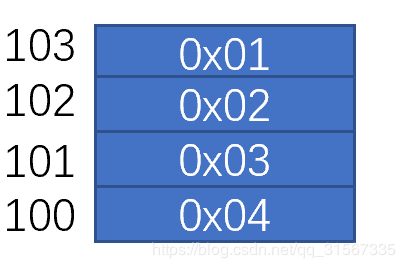

#1.问题

**当一个变量占多个字节的内存时，变量的指针指向的是高地址还是低地址？**

一直有一个疑惑：
int a =0x01020304;
如果a在内存中按如下方式存储（小端机器）:


100~103表示地址。
int *address=&a;
那么address 到底是等于100还是103呢？

#2.验证代码：
test.c

```cpp
void main()
{
  int a=0x01020304;
  
  unsigned char* a1=(unsigned char*)(&a);
  unsigned char* a2=(a1+1);
  unsigned char* a3=(a1+2);
  unsigned char* a4=(a1+3);
  
  
  printf("a:%x\n",  a);
  printf("a1:%d\n", *a1);
  printf("a2:%d\n", *a2);
  printf("a3:%d\n", *a3);
  printf("a4:%d\n", *a4);
  
  return ;
}
```

在写测试代码的时候发现，如果对int类型的指针加1，其实际执行的指令是加sizeof(int)。所以，对char类型的指针加1，才能获得预期的结果，因为sizeof(char)=1

#3.验证结果
> ➜  big_end_alignment git:(master) ✗ ./a.out
> a:1020304
> a1:4
> a2:3
> a3:2
> a4:1

#4.结论：
指针指向的是最低地址的那个字节。
