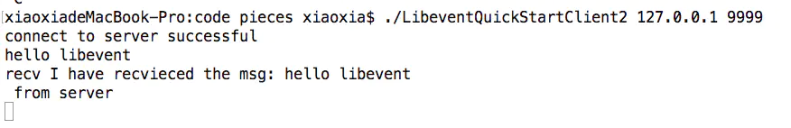
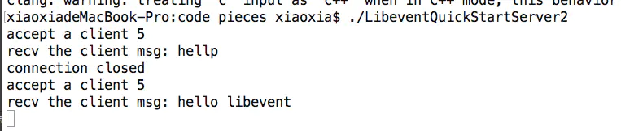

# libevent学习篇之一：libevent快速入门

[](https://www.jianshu.com/u/6c0c1835209e)

[shareLin](https://www.jianshu.com/u/6c0c1835209e)关注

0.9092016.10.19 15:08:48字数 1,212阅读 29,528

# LibEvent快速入门

## 简介

基本的socket变成是阻塞/同步的，每个操作除非已经完成，出错，或者超时才会返回，这样对于每一个请求，要使用一个线程或者单独的进程去处理，系统资源没有办法支撑大量的请求。posix定义了可以使用异步的select系统调用，但是因为它采用了轮询的方式来判断某个fd是否变成active，效率不高。于是各系统就分别提出了基于异步的系统调用，例如Linux的epoll，由于在内核层面做了支持，所以可以用O(1)的效率查找到active的fd。基本上，libevent就是对这些高效IO的封装，提供统一的API，简化开发。

## 原理简介

libevent默认情况下是单线程的，可以配置成多线程，每个线程有且只有一个event\_base，对应一个struct event\_base结构体以及附于其上的事件管理器，用来调度托管给它的一系列event，可以和操作系统的进程管理类比。当一个事件发生后，event\_base会在合适的时间，不一定是立即去调用绑定在这个事件上的函数，直到这个函数执行完，再去调度其他的事件。

```cpp
//创建一个event_base
struct event_base *base = event_base_new();
assert(base != NULL);
```

event\_base内部有一个循环，循环阻塞在epoll等系统调用上，直到有一个/一些时间发生，然后去处理这些事件。当然，这些事件要被绑定在这个event\_base上，每个事件对应一个struct event，可以是监听一个fd或者信号量之类的，struct event使用event\_new来创建和绑定，使用event\_add来将event绑定到event\_base中。

```csharp
// 创建并绑定一个event
struct event* listen_event;

//参数：event_base,监听的对象，需要监听的事件，事件发生后的回调函数，传给回调函数的参数
listen_event = event_new(base, listener, EV_READ | EV_PERSIST, callback_func, (void*)base);
//参数：event，超时时间，NULL表示无超时设置
event_add(listen_event, NULL);
```

注：libevent支持的事件及属性包括（使用bitfield实现）

1.  EV\_TIMEOUT:超时；
2.  EV\_READ:只要网络缓冲中还有数据，回调函数就会被触发；
3.  EV\_WRITE:只要塞给网络缓冲的数据被写完，回调函数就会被触发；
4.  EV\_SIGNAL:POSIX信号量；
5.  EV\_PERSIST:不指定这个属性，回调函数被触发后事件会被删除；
6.  EV\_ET:Edge-Trigger边缘触发（这个还不懂是什么意思）

然后启动event\_base的循环，开始处理事件。循环地启动使用event\_base\_dispatch，循环将一直持续，找到不再有需要关注的事件，或者是遇到event\_loopbreak()/event\_loopexit()函数。

```csharp
//启动循环，开始处理事件
event_base_dispatch(base);
```

接下来再来关注事件发生时的回调函数callback\_func，callback\_func的原型如下所示

```cpp
typedef void(* event_callback_fn)(evutil_socket_t sockfd, short event_type, void *arg)
```

传给callback\_func的是一个监听的fd，监听的事件类型，以及event\_new中最后一个参数。在上述程序中，是将event\_base传给了callback\_func，实际中更常用的是构造一个结构体，把需要传给回调函数的参数都放进来，然后传给event\_new，event\_new再传给回调函数。

所以总结一下，对于一个服务器而言，流程大致如下：

1.  获取待监听的内容的fd；
2.  创建一个event\_base；
3.  创建一个event,指定待监听的fd，待监听事件的类型，以及事件放生时的回调函数及传给回调函数的参数；
4.  将event添加到event\_base的事件管理器中；
5.  开启event\_base的事件处理循环；
6.  （异步）当事件发生的时候，调用前面设置的回调函数。

## 简易版QuickStart

下面的代码实现了一个简单的echo server，server启动后，client端启动并连接，在cmd中输入文字，server端收到后，将文字再返回给client。  
server端代码：

```cpp
/**
You need libevent2 to compile this piece of code
Please see: http://libevent.org/
Or you can simply run this command to install on Mac: brew install libevent
Cmd to compile this piece of code: g++ LibeventQuickStartServer.c  -o  LibeventQuickStartServer /usr/local/lib/libevent.a
**/
#include<stdio.h>  
#include<string.h>  
#include<errno.h>  
  
#include<unistd.h>  
#include<event.h>

void accept_cb(int fd, short events, void* arg);
void socket_read_cb(int fd, short events, void* arg);

int tcp_server_init(int port, int listen_num);

int main(int argc, char const *argv[])
{
    /* code */
    int listener = tcp_server_init(9999, 10);
    if (listener == -1)
    {
        perror("tcp_server_init error");
        return -1;
    }

    struct event_base* base = event_base_new();

    // 监听客户端请求链接事件
    struct event* ev_listen = event_new(base, listener, EV_READ | EV_PERSIST, accept_cb, base);

    event_add(ev_listen, NULL);

    event_base_dispatch(base);

    return 0;
}

void accept_cb(int fd, short events, void* arg)
{
    evutil_socket_t sockfd;

    struct sockaddr_in client;
    socklen_t len = sizeof(client);

    sockfd = ::accept(fd, (struct sockaddr*)&client, &len);
    evutil_make_socket_nonblocking(sockfd);

    printf("accept a client %d\n", sockfd);

    struct event_base* base = (event_base*)arg;

    //动态创建一个event结构体，并将其作为回调参数传递给
    struct event* ev = event_new(NULL, -1, 0, NULL, NULL);
    event_assign(ev, base, sockfd, EV_READ | EV_PERSIST, socket_read_cb, (void*)ev);

    event_add(ev, NULL);
}


void socket_read_cb(int fd, short events, void* arg)
{
    char msg[4096];
    struct event* ev = (struct event*)arg;
    int len = read(fd, msg, sizeof(msg) - 1);

    if(len <= 0)
    {
        printf("some error happen when read\n");
        event_free(ev);
        close(fd);
        return;
    }

    msg[len] = '\0';
    printf("recv the client msg : %s\n", msg);

    char reply_msg[4096] = "I have received the msg: ";
    strcat(reply_msg + strlen(reply_msg), msg);

    write(fd, reply_msg, strlen(reply_msg));
}

typedef struct sockaddr SA;  
int tcp_server_init(int port, int listen_num)  
{  
    int errno_save;  
    evutil_socket_t listener;  
  
    listener = ::socket(AF_INET, SOCK_STREAM, 0);  
    if( listener == -1 )  
        return -1;  
  
    //允许多次绑定同一个地址。要用在socket和bind之间  
    evutil_make_listen_socket_reuseable(listener);  
  
    struct sockaddr_in sin;  
    sin.sin_family = AF_INET;  
    sin.sin_addr.s_addr = 0;  
    sin.sin_port = htons(port);  
  
    if( ::bind(listener, (SA*)&sin, sizeof(sin)) < 0 )  
        goto error;  
  
    if( ::listen(listener, listen_num) < 0)  
        goto error;  
  
  
    //跨平台统一接口，将套接字设置为非阻塞状态  
    evutil_make_socket_nonblocking(listener);  
  
    return listener;  
  
    error:  
        errno_save = errno;  
        evutil_closesocket(listener);  
        errno = errno_save;  
  
        return -1;  
}  
```

client端代码：

```cpp

/**
You need libevent2 to compile this piece of code
Please see: http://libevent.org/
Or you can simply run this command to install on Mac: brew install libevent
Cmd to compile this piece of code: g++ LibeventQuickStartClient.c -o LibeventQuickStartClient /usr/local/lib/libevent.a
**/
#include<sys/types.h>  
#include<sys/socket.h>  
#include<netinet/in.h>  
#include<arpa/inet.h>  
#include<errno.h>  
#include<unistd.h>  
  
#include<stdio.h>  
#include<string.h>  
#include<stdlib.h>  
  
#include<event.h>  
#include<event2/util.h>  
  
  
  
  
int tcp_connect_server(const char* server_ip, int port);  
  
  
void cmd_msg_cb(int fd, short events, void* arg);  
void socket_read_cb(int fd, short events, void *arg);  
  
int main(int argc, char** argv)  
{  
    if( argc < 3 )  
    {  
        printf("please input 2 parameter\n");  
        return -1;  
    }  
  
  
    //两个参数依次是服务器端的IP地址、端口号  
    int sockfd = tcp_connect_server(argv[1], atoi(argv[2]));  
    if( sockfd == -1)  
    {  
        perror("tcp_connect error ");  
        return -1;  
    }  
  
    printf("connect to server successful\n");  
  
    struct event_base* base = event_base_new();  
  
    struct event *ev_sockfd = event_new(base, sockfd,  
                                        EV_READ | EV_PERSIST,  
                                        socket_read_cb, NULL);  
    event_add(ev_sockfd, NULL);  
  
    //监听终端输入事件  
    struct event* ev_cmd = event_new(base, STDIN_FILENO,  
                                      EV_READ | EV_PERSIST, cmd_msg_cb,  
                                      (void*)&sockfd);  
  
  
    event_add(ev_cmd, NULL);  
  
    event_base_dispatch(base);  
  
    printf("finished \n");  
    return 0;  
}  
  
  
  
  
  
  
void cmd_msg_cb(int fd, short events, void* arg)  
{  
    char msg[1024];  
  
    int ret = read(fd, msg, sizeof(msg));  
    if( ret <= 0 )  
    {  
        perror("read fail ");  
        exit(1);  
    }  
  
    int sockfd = *((int*)arg);  
  
    //把终端的消息发送给服务器端  
    //为了简单起见，不考虑写一半数据的情况  
    write(sockfd, msg, ret);  
}  
  
  
void socket_read_cb(int fd, short events, void *arg)  
{  
    char msg[1024];  
  
    //为了简单起见，不考虑读一半数据的情况  
    int len = read(fd, msg, sizeof(msg)-1);  
    if( len <= 0 )  
    {  
        perror("read fail ");  
        exit(1);  
    }  
  
    msg[len] = '\0';  
  
    printf("recv %s from server\n", msg);  
}  
  
  
  
typedef struct sockaddr SA;  
int tcp_connect_server(const char* server_ip, int port)  
{  
    int sockfd, status, save_errno;  
    struct sockaddr_in server_addr;  
  
    memset(&server_addr, 0, sizeof(server_addr) );  
  
    server_addr.sin_family = AF_INET;  
    server_addr.sin_port = htons(port);  
    status = inet_aton(server_ip, &server_addr.sin_addr);  
  
    if( status == 0 ) //the server_ip is not valid value  
    {  
        errno = EINVAL;  
        return -1;  
    }  
  
    sockfd = ::socket(PF_INET, SOCK_STREAM, 0);  
    if( sockfd == -1 )  
        return sockfd;  
  
  
    status = ::connect(sockfd, (SA*)&server_addr, sizeof(server_addr) );  
  
    if( status == -1 )  
    {  
        save_errno = errno;  
        ::close(sockfd);  
        errno = save_errno; //the close may be error  
        return -1;  
    }  
  
    evutil_make_socket_nonblocking(sockfd);  
  
    return sockfd;  
}  
```

程序运行截图

客户端

  



Paste\_Image.png

服务端



Paste\_Image.png

## 使用BufferEvent

在上面的代码中，client的cmd中有信息输入时，client直接将数据写入到fd中，server中收到信息后，也是直接将信息写入到fd中，因为fd是非阻塞的，所以不能保证正确。那么需要一个自己管理的缓存来管理自己的数据。那么步骤将稍微有些变化，如下所示：

1.  设置scokfd为nonblocking；
2.  使用bufferevent\_socket\_new创建一个struct bufferevent\* bev，关联上面的sockfd，并托管给event\_base;
3.  使用bufferevent\_setcb(bev, read\_cb, write\_cb, error\_cb, (void\*)arg)；
4.  使用buffevent\_enable(bev, EV\_READ|EV\_WRITE|EV\_PERSIST)来启动read/write事件

代码如下所示：

使用bufferevent的server端代码

```cpp
#include<stdio.h>
#include<string.h>
#include<errno.h>

#include<event.h>
#include<event2/bufferevent.h>


void accept_cb(int fd, short events, void* arg);
void socket_read_cb(bufferevent* bev, void* arg);
void event_cb(struct bufferevent *bev, short event, void *arg);
int tcp_server_init(int port, int listen_num);

int main(int argc, char** argv)
{

    int listener = tcp_server_init(9999, 10);
    if( listener == -1 )
    {
        perror(" tcp_server_init error ");
        return -1;
    }

    struct event_base* base = event_base_new();

    //添加监听客户端请求连接事件
    struct event* ev_listen = event_new(base, listener, EV_READ | EV_PERSIST,
                                        accept_cb, base);
    event_add(ev_listen, NULL);


    event_base_dispatch(base);
    event_base_free(base);


    return 0;
}


void accept_cb(int fd, short events, void* arg)
{
    evutil_socket_t sockfd;

    struct sockaddr_in client;
    socklen_t len = sizeof(client);

    sockfd = ::accept(fd, (struct sockaddr*)&client, &len );
    evutil_make_socket_nonblocking(sockfd);

    printf("accept a client %d\n", sockfd);

    struct event_base* base = (event_base*)arg;

    bufferevent* bev = bufferevent_socket_new(base, sockfd, BEV_OPT_CLOSE_ON_FREE);
    bufferevent_setcb(bev, socket_read_cb, NULL, event_cb, arg);

    bufferevent_enable(bev, EV_READ | EV_PERSIST);
}


void socket_read_cb(bufferevent* bev, void* arg)
{
    char msg[4096];

    size_t len = bufferevent_read(bev, msg, sizeof(msg));

    msg[len] = '\0';
    printf("recv the client msg: %s", msg);


    char reply_msg[4096] = "I have recvieced the msg: ";

    strcat(reply_msg + strlen(reply_msg), msg);
    bufferevent_write(bev, reply_msg, strlen(reply_msg));
}


void event_cb(struct bufferevent *bev, short event, void *arg)
{

    if (event & BEV_EVENT_EOF)
        printf("connection closed\n");
    else if (event & BEV_EVENT_ERROR)
        printf("some other error\n");

    //这将自动close套接字和free读写缓冲区
    bufferevent_free(bev);
}


typedef struct sockaddr SA;
int tcp_server_init(int port, int listen_num)
{
    int errno_save;
    evutil_socket_t listener;

    listener = ::socket(AF_INET, SOCK_STREAM, 0);
    if( listener == -1 )
        return -1;

    //允许多次绑定同一个地址。要用在socket和bind之间
    evutil_make_listen_socket_reuseable(listener);

    struct sockaddr_in sin;
    sin.sin_family = AF_INET;
    sin.sin_addr.s_addr = 0;
    sin.sin_port = htons(port);

    if( ::bind(listener, (SA*)&sin, sizeof(sin)) < 0 )
        goto error;

    if( ::listen(listener, listen_num) < 0)
        goto error;


    //跨平台统一接口，将套接字设置为非阻塞状态
    evutil_make_socket_nonblocking(listener);

    return listener;

    error:
        errno_save = errno;
        evutil_closesocket(listener);
        errno = errno_save;

        return -1;
}
```

使用bufferevent的client端代码

```cpp
#include<sys/types.h>  
#include<sys/socket.h>  
#include<netinet/in.h>  
#include<arpa/inet.h>  
#include<errno.h>  
#include<unistd.h>  
  
#include<stdio.h>  
#include<string.h>  
#include<stdlib.h>  
  
#include<event.h>  
#include<event2/bufferevent.h>  
#include<event2/buffer.h>  
#include<event2/util.h>  
  
  
  
  
int tcp_connect_server(const char* server_ip, int port);  
  
  
void cmd_msg_cb(int fd, short events, void* arg);  
void server_msg_cb(struct bufferevent* bev, void* arg);  
void event_cb(struct bufferevent *bev, short event, void *arg);  
  
int main(int argc, char** argv)  
{  
    if( argc < 3 )  
    {  
        printf("please input 2 parameter\n");  
        return -1;  
    }  
  
  
    //两个参数依次是服务器端的IP地址、端口号  
    int sockfd = tcp_connect_server(argv[1], atoi(argv[2]));  
    if( sockfd == -1)  
    {  
        perror("tcp_connect error ");  
        return -1;  
    }  
  
    printf("connect to server successful\n");  
  
    struct event_base* base = event_base_new();  
  
    struct bufferevent* bev = bufferevent_socket_new(base, sockfd,  
                                                     BEV_OPT_CLOSE_ON_FREE);  
  
    //监听终端输入事件  
    struct event* ev_cmd = event_new(base, STDIN_FILENO,  
                                      EV_READ | EV_PERSIST, cmd_msg_cb,  
                                      (void*)bev);  
    event_add(ev_cmd, NULL);  
  
    //当socket关闭时会用到回调参数  
    bufferevent_setcb(bev, server_msg_cb, NULL, event_cb, (void*)ev_cmd);  
    bufferevent_enable(bev, EV_READ | EV_PERSIST);  
  
  
    event_base_dispatch(base);  
  
    printf("finished \n");  
    return 0;  
}  
  
  
  
  
  
  
void cmd_msg_cb(int fd, short events, void* arg)  
{  
    char msg[1024];  
  
    int ret = read(fd, msg, sizeof(msg));  
    if( ret < 0 )  
    {  
        perror("read fail ");  
        exit(1);  
    }  
  
    struct bufferevent* bev = (struct bufferevent*)arg;  
  
    //把终端的消息发送给服务器端  
    bufferevent_write(bev, msg, ret);  
}  
  
  
void server_msg_cb(struct bufferevent* bev, void* arg)  
{  
    char msg[1024];  
  
    size_t len = bufferevent_read(bev, msg, sizeof(msg));  
    msg[len] = '\0';  
  
    printf("recv %s from server\n", msg);  
}  
  
  
void event_cb(struct bufferevent *bev, short event, void *arg)  
{  
  
    if (event & BEV_EVENT_EOF)  
        printf("connection closed\n");  
    else if (event & BEV_EVENT_ERROR)  
        printf("some other error\n");  
  
    //这将自动close套接字和free读写缓冲区  
    bufferevent_free(bev);  
  
    struct event *ev = (struct event*)arg;  
    //因为socket已经没有，所以这个event也没有存在的必要了  
    event_free(ev);  
}  
  
  
typedef struct sockaddr SA;  
int tcp_connect_server(const char* server_ip, int port)  
{  
    int sockfd, status, save_errno;  
    struct sockaddr_in server_addr;  
  
    memset(&server_addr, 0, sizeof(server_addr) );  
  
    server_addr.sin_family = AF_INET;  
    server_addr.sin_port = htons(port);  
    status = inet_aton(server_ip, &server_addr.sin_addr);  
  
    if( status == 0 ) //the server_ip is not valid value  
    {  
        errno = EINVAL;  
        return -1;  
    }  
  
    sockfd = ::socket(PF_INET, SOCK_STREAM, 0);  
    if( sockfd == -1 )  
        return sockfd;  
  
  
    status = ::connect(sockfd, (SA*)&server_addr, sizeof(server_addr) );  
  
    if( status == -1 )  
    {  
        save_errno = errno;  
        ::close(sockfd);  
        errno = save_errno; //the close may be error  
        return -1;  
    }  
  
    evutil_make_socket_nonblocking(sockfd);  
  
    return sockfd;  
}  
```

欢迎留言交流学习  
参考链接：  
[https://www.felix021.com/blog/read.php?2068](https://link.jianshu.com/?t=https://www.felix021.com/blog/read.php?2068)  
[http://blog.csdn.net/luotuo44/article/details/39670221](https://link.jianshu.com/?t=http://blog.csdn.net/luotuo44/article/details/39670221)

32人点赞

[Rpc框架学习](https://www.jianshu.com/nb/6949997)

更多精彩内容，就在简书APP


"小礼物走一走，来简书关注我"

赞赏支持

共1人赞赏

[](https://www.jianshu.com/u/6c0c1835209e)

[shareLin](https://www.jianshu.com/u/6c0c1835209e "shareLin")欢迎关注，交流及讨论！<br><br><br><br>

总资产1共写了1.1W字获得180个赞共120个粉丝

关注