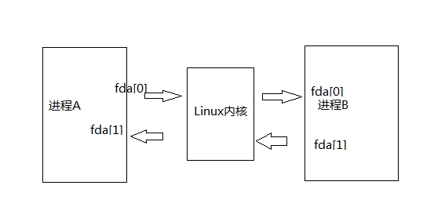
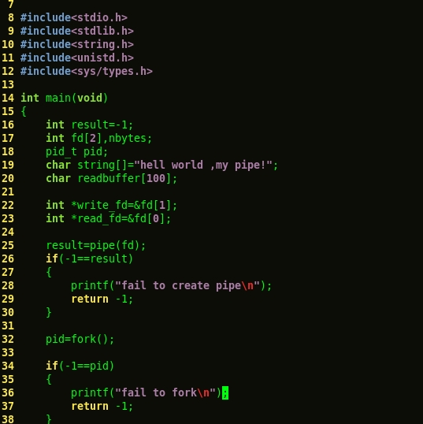
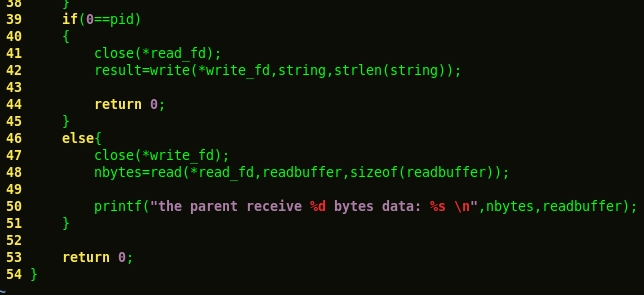
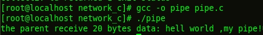
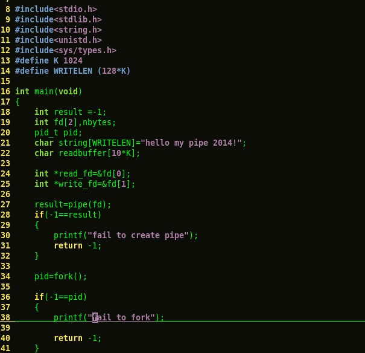
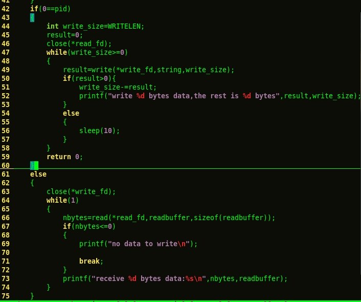
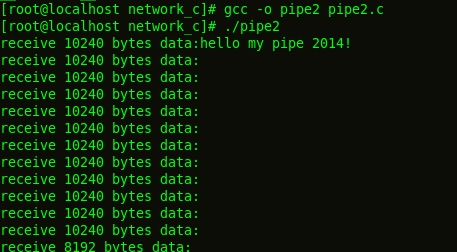

# [linux编程之pipe()函数](https://www.cnblogs.com/kunhu/p/3608109.html)

管道是一种把两个进程之间的标准输入和标准输出连接起来的机制，从而提供一种让多个进程间通信的方法，当进程创建管道时，每次

都需要提供两个文件描述符来操作管道。其中一个对管道进行写操作，另一个对管道进行读操作。对管道的读写与一般的IO系统函数一

致，使用write()函数写入数据，使用read()读出数据。

#include<unistd.h>

int pipe(int filedes\[2\]);

返回值：成功，返回0，否则返回-1。参数数组包含pipe使用的两个文件的描述符。fd\[0\]:读管道，fd\[1\]:写管道。

必须在fork()中调用pipe()，否则子进程不会继承文件描述符。两个进程不共享祖先进程，就不能使用pipe。但是可以使用命名管道。

当管道进行写入操作的时候，如果写入的数据小于128K则是非原子的，如果大于128K字节，缓冲区的数据将被连续地写入

管道，直到全部数据写完为止，如果没有进程读取数据，则将一直阻塞,如下：

在上例程序中，子进程一次性写入128K数据，当父进程将全部数据读取完毕的时候，子进程的write()函数才结束阻塞并且

返回写入信息。

命名管道FIFO

管道最大的劣势就是没有名字，只能用于有一个共同祖先进程的各个进程之间。FIFO代表先进先出，单它是一个单向数据流，也就是半双工，和

管道不同的是：每个FIFO都有一个路径与之关联，从而允许无亲缘关系的进程访问。 

 #include <sys/types.h>

 #include <sys/stat.h>

 int mkfifo(const char \*pathname, mode\_t mode);  
 这里pathname是路径名,mode是sys/stat.h里面定义的创建文件的权限.

以下示例程序来自：http://blog.chinaunix.net/uid-20498361-id-1940238.html

 有亲缘关系进程间的fifo的例子  
  

<table style="height: 1007px; width: 1038px" border="1" cellspacing="0" cellpadding="0" bgcolor="#f1f1f1"><tbody><tr><td>
<code>/* &nbsp;* 有亲缘关系的进程间的fifo的使用 &nbsp;* fifo 使用的简单例子 &nbsp;*/  #include&nbsp;"../all.h"  #define&nbsp;FIFO_PATH&nbsp;"/tmp/hover_fifo"   void&nbsp; do_sig(int&nbsp;signo) { &nbsp;&nbsp;&nbsp;&nbsp;if&nbsp;(signo&nbsp;==&nbsp;SIGCHLD) &nbsp;&nbsp;&nbsp;&nbsp;&nbsp;&nbsp;&nbsp;&nbsp;while&nbsp;(waitpid(-1,&nbsp;NULL,&nbsp;WNOHANG)&nbsp;&gt;&nbsp;0) &nbsp;&nbsp;&nbsp;&nbsp;&nbsp;&nbsp;&nbsp;&nbsp;&nbsp;&nbsp;&nbsp;&nbsp;; } </code>

<code> int main(void) { &nbsp;&nbsp;&nbsp;&nbsp;int&nbsp;ret; &nbsp;&nbsp;&nbsp;&nbsp;int&nbsp;fdr,&nbsp;fdw; &nbsp;&nbsp;&nbsp;&nbsp;pid_t&nbsp;pid;  &nbsp;&nbsp;&nbsp;&nbsp;char&nbsp;words[10]&nbsp;=&nbsp;"123456789"; &nbsp;&nbsp;&nbsp;&nbsp;char&nbsp;buf[10]&nbsp;=&nbsp;{'\0'};&nbsp;&nbsp;&nbsp;&nbsp; &nbsp;&nbsp;&nbsp;&nbsp; &nbsp;&nbsp;&nbsp;&nbsp;// 创建它,若存在则不算是错误, &nbsp;&nbsp;&nbsp;&nbsp;// 若想修改其属性需要先打开得到fd,然后用fcntl来获取属性,然后设置属性.  &nbsp;&nbsp;&nbsp;&nbsp;if&nbsp;(((ret&nbsp;=&nbsp;mkfifo(FIFO_PATH,&nbsp;FILE_MODE))&nbsp;==&nbsp;-1)&nbsp; </code>

<code>&nbsp;&nbsp;&nbsp;&nbsp;&nbsp;&nbsp;&nbsp;&nbsp;&nbsp;&nbsp;&nbsp;&nbsp;&nbsp;&nbsp;&nbsp;&nbsp;&nbsp;&nbsp;&nbsp;&nbsp; &amp;&amp;&nbsp;(errno&nbsp;!=&nbsp;EEXIST)) &nbsp;&nbsp;&nbsp;&nbsp;&nbsp;&nbsp;&nbsp;&nbsp;perr_exit("mkfifo()"); &nbsp;&nbsp;&nbsp;&nbsp;fprintf(stderr,&nbsp;"fifo : %s created successfully!\n",&nbsp;FIFO_PATH);  &nbsp;&nbsp;&nbsp;&nbsp;signal(SIGCHLD,&nbsp;do_sig);  &nbsp;&nbsp;&nbsp;&nbsp;pid&nbsp;=&nbsp;fork(); &nbsp;&nbsp;&nbsp;&nbsp;if&nbsp;(pid&nbsp;==&nbsp;0)&nbsp;{&nbsp;// child  &nbsp;&nbsp;&nbsp;&nbsp;&nbsp;&nbsp;&nbsp;&nbsp;if&nbsp;((fdr&nbsp;=&nbsp;open(FIFO_PATH,&nbsp;O_WRONLY))&nbsp;&lt;&nbsp;0)&nbsp;// 打开fifo用来写 &nbsp;&nbsp;&nbsp;&nbsp;&nbsp;&nbsp;&nbsp;&nbsp;&nbsp;&nbsp;&nbsp;&nbsp;perr_exit("open()"); &nbsp;&nbsp;&nbsp;&nbsp;&nbsp;&nbsp;&nbsp;&nbsp;sleep(2);</code>

<code>&nbsp;&nbsp;&nbsp;&nbsp;&nbsp;&nbsp;&nbsp; // 写入数据</code><code> &nbsp;&nbsp;&nbsp;&nbsp;&nbsp;&nbsp;&nbsp;&nbsp;if&nbsp;(write(fdr,&nbsp;words,&nbsp;sizeof(words))&nbsp;!=&nbsp;sizeof(words))&nbsp; &nbsp;&nbsp;&nbsp;&nbsp;&nbsp;&nbsp;&nbsp;&nbsp;&nbsp;&nbsp;&nbsp;&nbsp;perr_exit("write"); &nbsp;&nbsp;&nbsp;&nbsp;&nbsp;&nbsp;&nbsp;&nbsp;fprintf(stderr,&nbsp;"child write : %s\n",&nbsp;words); &nbsp;&nbsp;&nbsp;&nbsp;&nbsp;&nbsp;&nbsp;&nbsp;close(fdw); &nbsp;&nbsp;&nbsp;&nbsp;}&nbsp;else&nbsp;if&nbsp;(pid&nbsp;&gt;&nbsp;0)&nbsp;{&nbsp;// parent  &nbsp;&nbsp;&nbsp;&nbsp;&nbsp;&nbsp;&nbsp;&nbsp;if&nbsp;((fdr&nbsp;=&nbsp;open(FIFO_PATH,&nbsp;O_RDONLY))&nbsp;&lt;&nbsp;0)&nbsp;// 打开fifo用来读  &nbsp;&nbsp;&nbsp;&nbsp;&nbsp;&nbsp;&nbsp;&nbsp;&nbsp;&nbsp;&nbsp;&nbsp;perr_exit("open()");  &nbsp;&nbsp;&nbsp;&nbsp;&nbsp;&nbsp;&nbsp;&nbsp;fprintf(stderr,&nbsp;"I father read, waiting for child ...\n"); &nbsp;&nbsp;&nbsp;&nbsp;&nbsp;&nbsp;&nbsp;&nbsp;if&nbsp;(read(fdr,&nbsp;buf,&nbsp;9)&nbsp;!=&nbsp;9)&nbsp;//读数据 &nbsp;&nbsp;&nbsp;&nbsp;&nbsp;&nbsp;&nbsp;&nbsp;&nbsp;&nbsp;&nbsp;&nbsp;perr_exit("read");  &nbsp;&nbsp;&nbsp;&nbsp;&nbsp;&nbsp;&nbsp;&nbsp;fprintf(stderr,&nbsp;"father get buf : %s\n",&nbsp;buf); &nbsp;&nbsp;&nbsp;&nbsp;&nbsp;&nbsp;&nbsp;&nbsp;close(fdr); &nbsp;&nbsp;&nbsp;&nbsp;} &nbsp;&nbsp;&nbsp;&nbsp;// 到这里fifo管道并没有被删除,必须手动调用函数unlink或remove删除.  &nbsp;&nbsp;&nbsp;&nbsp;return&nbsp;0;&nbsp;&nbsp;&nbsp;&nbsp; }  </code>
</td></tr></tbody></table>

  
从例子上可以看出使用fifo时需要注意:  
\*fifo管道是先调用mkfifo创建,然后再用open打开得到fd来使用.  
\*在打开fifo时要注意,它是半双工的的,一般不能使用O\_RDWR打开,而只能用只读或只写打开.  
  
 fifo可以用在非亲缘关系的进程间,而它的真正用途是在服务器和客户端之间. 由于它是半双工的所以,如果要进行客户端和服务器双方的通信的话,

每个方向都必须建立两个管道,一个用于读,一个用于写.  
  
下面是一个服务器,对多个客户端的fifo的例子:  
  
server 端的例子:  
  
  
  

<table style="width: 1045px; height: 1042px" border="1" cellspacing="0" cellpadding="0" bgcolor="#f1f1f1"><tbody><tr><td>
<code>/* &nbsp;* FIFO server &nbsp;*/  #include&nbsp;"all.h"  int main(void) { &nbsp;&nbsp;&nbsp;&nbsp;int&nbsp;fdw,&nbsp;fdw2; &nbsp;&nbsp;&nbsp;&nbsp;int&nbsp;fdr; &nbsp;&nbsp;&nbsp;&nbsp;char&nbsp;clt_path[PATH_LEN]&nbsp;=&nbsp;{'\0'}; &nbsp;&nbsp;&nbsp;&nbsp;char&nbsp;buf[MAX_LINE]&nbsp;=&nbsp;{'\0'}; &nbsp;&nbsp;&nbsp;&nbsp;char&nbsp;*p; &nbsp;&nbsp;&nbsp;&nbsp;int&nbsp;n; &nbsp;&nbsp;&nbsp;&nbsp; &nbsp;&nbsp;&nbsp;&nbsp;if&nbsp;(mkfifo(FIFO_SVR,&nbsp;FILE_MODE)&nbsp;==&nbsp;-1&nbsp;&amp;&amp;&nbsp;errno&nbsp;!=&nbsp;EEXIST)&nbsp;&nbsp;&nbsp;&nbsp; &nbsp;&nbsp;&nbsp;&nbsp;&nbsp;&nbsp;&nbsp;&nbsp;perr_exit("mkfifo()");&nbsp;&nbsp;&nbsp;&nbsp; &nbsp;&nbsp;&nbsp;&nbsp;if&nbsp;((fdr&nbsp;=&nbsp;open(FIFO_SVR,&nbsp;O_RDONLY))&nbsp;&lt;&nbsp;0)&nbsp;&nbsp;&nbsp;&nbsp; &nbsp;&nbsp;&nbsp;&nbsp;&nbsp;&nbsp;&nbsp;&nbsp;perr_exit("open()"); &nbsp;&nbsp;&nbsp;&nbsp;/*&nbsp; &nbsp;&nbsp;&nbsp;&nbsp; * 根据fifo的创建规则, 若从一个空管道或fifo读,&nbsp; </code>

<code>&nbsp;&nbsp;&nbsp;&nbsp; * 而在读之前管道或fifo有打开来写的操作, 那么读操作将会阻塞&nbsp; &nbsp;&nbsp;&nbsp;&nbsp; * 直到管道或fifo不打开来读, 或管道或fifo中有数据为止.&nbsp; </code>

<code>&nbsp;&nbsp;&nbsp;&nbsp; * </code>

<code>&nbsp;&nbsp;&nbsp;&nbsp; * 这里,我们的fifo本来是打开用来读的,但是为了,read不返回0,</code>

<code>&nbsp;&nbsp;&nbsp;&nbsp; * 让每次client端读完都阻塞在fifo上,我们又打开一次来读. &nbsp;&nbsp;&nbsp;&nbsp; * 见unpv2 charper 4.7 &nbsp;&nbsp;&nbsp;&nbsp; */ &nbsp;&nbsp;&nbsp;&nbsp;if&nbsp;((fdw2&nbsp;=&nbsp;open(FIFO_SVR,&nbsp;O_WRONLY))&nbsp;&lt;&nbsp;0)&nbsp;&nbsp;&nbsp;&nbsp; &nbsp;&nbsp;&nbsp;&nbsp;&nbsp;&nbsp;&nbsp;&nbsp;fprintf(stderr,&nbsp;"open()"); &nbsp;&nbsp;&nbsp;&nbsp; &nbsp;&nbsp;&nbsp;&nbsp;while&nbsp;(1)&nbsp;{ &nbsp;&nbsp;&nbsp;&nbsp;&nbsp;&nbsp;&nbsp;&nbsp;/* read client fifo path from FIFO_SVR */ </code>

<code>&nbsp;&nbsp;&nbsp;&nbsp; /* 这里由于FIFO_SVR有打开来写的操作,所以当管道没有数据时,&nbsp; </code>

<code>&nbsp;&nbsp;&nbsp;&nbsp;&nbsp; * read会阻塞,而不是返回0.&nbsp; </code>

<code>&nbsp;&nbsp;&nbsp;&nbsp;&nbsp; */ &nbsp;&nbsp;&nbsp;&nbsp;&nbsp;&nbsp;&nbsp;&nbsp;if&nbsp;(read(fdr,&nbsp;clt_path,&nbsp;PATH_LEN)&nbsp;&lt;&nbsp;0)&nbsp;{ &nbsp;&nbsp;&nbsp;&nbsp;&nbsp;&nbsp;&nbsp;&nbsp;&nbsp;&nbsp;&nbsp;&nbsp;fprintf(stderr,&nbsp;"read fifo client path error : %s\n",&nbsp;strerror(errno));&nbsp;&nbsp;&nbsp;&nbsp; &nbsp;&nbsp;&nbsp;&nbsp;&nbsp;&nbsp;&nbsp;&nbsp;&nbsp;&nbsp;&nbsp;&nbsp;break; &nbsp;&nbsp;&nbsp;&nbsp;&nbsp;&nbsp;&nbsp;&nbsp;} &nbsp;&nbsp;&nbsp;&nbsp;&nbsp;&nbsp;&nbsp;&nbsp;if&nbsp;((p&nbsp;=&nbsp;strstr(clt_path,&nbsp;"\r\n"))&nbsp;==&nbsp;NULL)&nbsp;{ &nbsp;&nbsp;&nbsp;&nbsp;&nbsp;&nbsp;&nbsp;&nbsp;&nbsp;&nbsp;&nbsp;&nbsp;fprintf(stderr,&nbsp;"clt_path error: %s\n",&nbsp;clt_path); &nbsp;&nbsp;&nbsp;&nbsp;&nbsp;&nbsp;&nbsp;&nbsp;&nbsp;&nbsp;&nbsp;&nbsp;break; &nbsp;&nbsp;&nbsp;&nbsp;&nbsp;&nbsp;&nbsp;&nbsp;} &nbsp;&nbsp;&nbsp;&nbsp;&nbsp;&nbsp;&nbsp;&nbsp;*p&nbsp;=&nbsp;'\0'; &nbsp;&nbsp;&nbsp;&nbsp;&nbsp;&nbsp;&nbsp;&nbsp;DBG("clt_path",&nbsp;clt_path); &nbsp;&nbsp;&nbsp;&nbsp;&nbsp;&nbsp;&nbsp;&nbsp;if&nbsp;(access(clt_path,&nbsp;W_OK)&nbsp;==&nbsp;-1)&nbsp;{&nbsp;// client fifo ok, but no permission  &nbsp;&nbsp;&nbsp;&nbsp;&nbsp;&nbsp;&nbsp;&nbsp;&nbsp;&nbsp;&nbsp;&nbsp;perror("access()");&nbsp;&nbsp;&nbsp;&nbsp; &nbsp;&nbsp;&nbsp;&nbsp;&nbsp;&nbsp;&nbsp;&nbsp;&nbsp;&nbsp;&nbsp;&nbsp;continue; &nbsp;&nbsp;&nbsp;&nbsp;&nbsp;&nbsp;&nbsp;&nbsp;} &nbsp;&nbsp;&nbsp;&nbsp;&nbsp;&nbsp;&nbsp;&nbsp;/* open client fifo for write */ &nbsp;&nbsp;&nbsp;&nbsp;&nbsp;&nbsp;&nbsp;&nbsp;if&nbsp;((fdw&nbsp;=&nbsp;open(clt_path,&nbsp;O_WRONLY))&nbsp;&lt;&nbsp;0)&nbsp;{ &nbsp;&nbsp;&nbsp;&nbsp;&nbsp;&nbsp;&nbsp;&nbsp;&nbsp;&nbsp;&nbsp;&nbsp;perror("open()");&nbsp;&nbsp;&nbsp;&nbsp; &nbsp;&nbsp;&nbsp;&nbsp;&nbsp;&nbsp;&nbsp;&nbsp;&nbsp;&nbsp;&nbsp;&nbsp;continue; &nbsp;&nbsp;&nbsp;&nbsp;&nbsp;&nbsp;&nbsp;&nbsp;} &nbsp;&nbsp;&nbsp;&nbsp;&nbsp;&nbsp;&nbsp;&nbsp;if&nbsp;((n&nbsp;=&nbsp;read(fdr,&nbsp;buf,&nbsp;WORDS_LEN))&nbsp;&gt;&nbsp;0)&nbsp;{&nbsp;/* read server words is ok */ &nbsp;&nbsp;&nbsp;&nbsp;&nbsp;&nbsp;&nbsp;&nbsp;&nbsp;&nbsp;&nbsp;&nbsp;printf("server read words : %s\n",&nbsp;buf); &nbsp;&nbsp;&nbsp;&nbsp;&nbsp;&nbsp;&nbsp;&nbsp;&nbsp;&nbsp;&nbsp;&nbsp;buf[n]&nbsp;=&nbsp;'\0'; &nbsp;&nbsp;&nbsp;&nbsp;&nbsp;&nbsp;&nbsp;&nbsp;&nbsp;&nbsp;&nbsp;&nbsp;write(fdw,&nbsp;buf,&nbsp;strlen(buf));&nbsp;&nbsp;&nbsp;&nbsp; &nbsp;&nbsp;&nbsp;&nbsp;&nbsp;&nbsp;&nbsp;&nbsp;} &nbsp;&nbsp;&nbsp;&nbsp;} &nbsp;&nbsp;&nbsp;&nbsp; &nbsp;&nbsp;&nbsp;&nbsp;close(fdw);&nbsp;&nbsp;&nbsp;&nbsp; &nbsp;&nbsp;&nbsp;&nbsp;unlink(FIFO_SVR); &nbsp;&nbsp;&nbsp;&nbsp;exit(0); }</code>
</td></tr></tbody></table>

  
客户端的例子:  
  
  

<table style="width: 95%" border="1" cellspacing="0" cellpadding="0" bgcolor="#f1f1f1"><tbody><tr><td>
<code>/* &nbsp;* Fifo client &nbsp;* &nbsp;*/ #include&nbsp;"all.h"    int main(void) { &nbsp;&nbsp;&nbsp;&nbsp;int&nbsp;fdr,&nbsp;fdw; &nbsp;&nbsp;&nbsp;&nbsp;pid_t&nbsp;pid;&nbsp;&nbsp;&nbsp;&nbsp; &nbsp;&nbsp;&nbsp;&nbsp;char&nbsp;clt_path[PATH_LEN]&nbsp;=&nbsp;{'\0'}; &nbsp;&nbsp;&nbsp;&nbsp;char&nbsp;buf[MAX_LINE]&nbsp;=&nbsp;{'\0'}; &nbsp;&nbsp;&nbsp;&nbsp;char&nbsp;buf_path[MAX_LINE]&nbsp;=&nbsp;{'\0'}; &nbsp;&nbsp;&nbsp;&nbsp; &nbsp;&nbsp;&nbsp;&nbsp;snprintf(clt_path,&nbsp;PATH_LEN,&nbsp;FIFO_CLT_FMT,&nbsp;(long)getpid());&nbsp;&nbsp;&nbsp;&nbsp;&nbsp;&nbsp;&nbsp;&nbsp; &nbsp;&nbsp;&nbsp;&nbsp;DBG("clt_path1 = ",&nbsp;clt_path); &nbsp;&nbsp;&nbsp;&nbsp;snprintf(buf_path,&nbsp;PATH_LEN,&nbsp;"%s\r\n",&nbsp;clt_path);  &nbsp;&nbsp;&nbsp;&nbsp;if&nbsp;(mkfifo(clt_path,&nbsp;FILE_MODE)&nbsp;==&nbsp;-1&nbsp;&amp;&amp;&nbsp;errno&nbsp;!=&nbsp;EEXIST)&nbsp;&nbsp;&nbsp;&nbsp; &nbsp;&nbsp;&nbsp;&nbsp;&nbsp;&nbsp;&nbsp;&nbsp;perr_exit("mkfifo()");  &nbsp;&nbsp;&nbsp;&nbsp;/* client open clt_path for read &nbsp;&nbsp;&nbsp;&nbsp; * open server for write&nbsp; &nbsp;&nbsp;&nbsp;&nbsp;&nbsp;&nbsp; */ &nbsp;&nbsp;&nbsp;&nbsp;if&nbsp;((fdw&nbsp;=&nbsp;open(FIFO_SVR,&nbsp;O_WRONLY))&nbsp;&lt;&nbsp;0)&nbsp; &nbsp;&nbsp;&nbsp;&nbsp;&nbsp;&nbsp;&nbsp;&nbsp;perr_exit("open()"); &nbsp;&nbsp;&nbsp;&nbsp; &nbsp;&nbsp;&nbsp;&nbsp;/* write my fifo path to server */&nbsp;&nbsp;&nbsp;&nbsp; &nbsp;&nbsp;&nbsp;&nbsp;if&nbsp;(write(fdw,&nbsp;buf_path,&nbsp;PATH_LEN)&nbsp;!=&nbsp;PATH_LEN)&nbsp;&nbsp;&nbsp;&nbsp;&nbsp;&nbsp;&nbsp;&nbsp; &nbsp;&nbsp;&nbsp;&nbsp;&nbsp;&nbsp;&nbsp;&nbsp;perr_exit("write()"); &nbsp;&nbsp;&nbsp;&nbsp;if&nbsp;(write(fdw,&nbsp;WORDS,&nbsp;WORDS_LEN)&nbsp;&lt;&nbsp;0)&nbsp;&nbsp;&nbsp;&nbsp;/* write words to fifo server */ &nbsp;&nbsp;&nbsp;&nbsp;&nbsp;&nbsp;&nbsp;&nbsp;perr_exit("error");  &nbsp;&nbsp;&nbsp;&nbsp;if&nbsp;((fdr&nbsp;=&nbsp;open(clt_path,&nbsp;O_RDONLY))&nbsp;&lt;&nbsp;0)&nbsp;&nbsp;&nbsp;&nbsp; &nbsp;&nbsp;&nbsp;&nbsp;&nbsp;&nbsp;&nbsp;&nbsp;perr_exit("open()"); &nbsp;&nbsp;&nbsp;&nbsp;if&nbsp;(read(fdr,&nbsp;buf,&nbsp;WORDS_LEN)&nbsp;&gt;&nbsp;0)&nbsp;{&nbsp;&nbsp;&nbsp;&nbsp;&nbsp;/* read reply from fifo server */ &nbsp;&nbsp;&nbsp;&nbsp;&nbsp;&nbsp;&nbsp;&nbsp;buf[WORDS_LEN]&nbsp;=&nbsp;'\0'; &nbsp;&nbsp;&nbsp;&nbsp;&nbsp;&nbsp;&nbsp;&nbsp;printf("server said : %s\n",&nbsp;buf); &nbsp;&nbsp;&nbsp;&nbsp;} &nbsp;&nbsp;&nbsp;&nbsp; &nbsp;&nbsp;&nbsp;&nbsp;close(fdr); &nbsp;&nbsp;&nbsp;&nbsp;unlink(clt_path); &nbsp;&nbsp;&nbsp;&nbsp; &nbsp;&nbsp;&nbsp;&nbsp;exit(0); }</code>
</td></tr></tbody></table>

分类: [Linux](https://www.cnblogs.com/kunhu/category/539125.html)

[好文要顶](javascript:) [关注我](javascript:) [收藏该文](javascript:)  

[拦云](https://home.cnblogs.com/u/kunhu/)  
[关注 - 16](https://home.cnblogs.com/u/kunhu/followees/)  
[粉丝 - 51](https://home.cnblogs.com/u/kunhu/followers/)

[+加关注](javascript:)

5

0

[«](https://www.cnblogs.com/kunhu/p/3607376.html) 上一篇： [linux中fork（）函数详解(转)](https://www.cnblogs.com/kunhu/p/3607376.html "发布于 2014-03-18 12:40")  
[»](https://www.cnblogs.com/kunhu/p/3608589.html) 下一篇： [linux编程之消息队列](https://www.cnblogs.com/kunhu/p/3608589.html "发布于 2014-03-18 19:53")

posted @ 2014-03-18 16:43  [拦云](https://www.cnblogs.com/kunhu/)  阅读(112684)  评论(2)  [编辑](https://i.cnblogs.com/EditPosts.aspx?postid=3608109)  [收藏](javascript:)  [举报](javascript:)